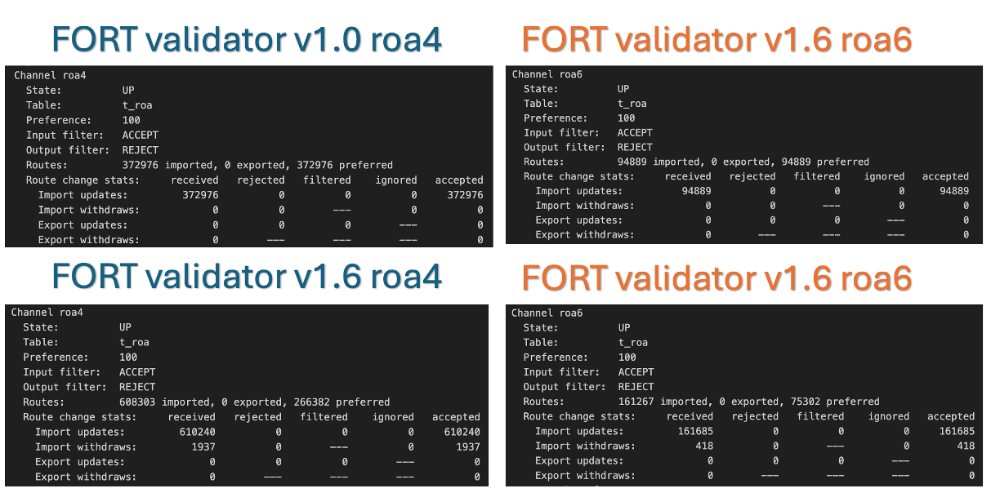

# RPKI Ghost: the invisible risk in route validation
**By Carlos Pérez / NIC – CRIX Costa Rica**

> 🇪🇸 This article is also available in Spanish:  
> [RPKI Ghost: el riesgo invisible en la validación de rutas](rpki-ghost.md)

Today, in an environment where AI and best-practice manuals are everywhere, even when following community standards we can fall into a dangerous trap: **assuming that RPKI security “just works.”**

To this, we must add the classic mindset of **“if it works, don’t touch it,”** which is very common among operators and administrators.  
And then the key question arises:

> **How many obsolete validators are still in production today, believing they protect the network while delivering incomplete data?**

Although it may sound unlikely, it is totally plausible that there are ISPs —and even IXPs— that believe they are protected simply because their RPKI validator is running, with no visible errors and no alerts.

> And that is precisely where the problem begins:

---

## ⚠️ An outdated validator can become a “Ghost”: it looks like it works, but it doesn’t actually validate.

Many operators configured their validators years ago, when **RSYNC (RFC 9286)** was the main synchronization method.  
But since then, the RIRs —LACNIC, RIPE NCC, APNIC, AFRINIC and ARIN— have migrated to **RRDP (RFC 8210)**, an HTTPS-based mechanism that is much faster, more efficient and less costly for repositories.

The problem is that many **old validators do not correctly process RRDP**, and still depend almost entirely on RSYNC, which today should only be used as a fallback.  
And the most serious part: **operators don’t realize it.**

---

## 🔍 What if your validator stopped validating years ago… but you never noticed because the RTR session remained “Established”?

That is the essence of **Ghost RPKI**:

➡️ *A validator that appears healthy, but with broken validation and no visible symptoms.*

---

## 📊 Real comparison: FORT v1.0 vs FORT v1.6  

Below are shown the large differences in the number of imported and preferred ROAs between an outdated validator and an updated one.

---

## 📋 BIRD tables (real validator states)

**Figure 1 –** Actual BIRD output showing differences between old and updated validators.

---

## 📊 Comparison of imported ROAs

**Figure 2 –** Comparison of **imported** ROAs for FORT v1.0 and v1.6 (IPv4 and IPv6).  
The old version loses a large amount of data due to incomplete RRDP support.

---

## 📊 Imported vs preferred ROAs (full comparison)

**Figure 3 –** Comparison between imported and preferred ROAs.  
FORT v1.0 shows major inconsistencies that reveal degraded validation (*“Ghost RPKI”*).

---

## Why does this happen?

An outdated validator can:

- Fail to interpret modern RRDP changes  
- Duplicate or process objects incorrectly  
- Accumulate inconsistent states by relying only on RSYNC  
- Fail to recognize objects introduced after 2021  
- Create a false sense of security (**“Ghost Security”**)  

---

## 🧩 Conclusion  

In simple terms, **“Ghost RPKI”** is a validator that appears functional but actually protects using incomplete, corrupted or outdated data.

And that is where we fall into:  
**“False security is worse than having no RPKI at all.”**

Because when everything looks *UP* in the CLI and the validator shows no errors, the operator trusts it — but beware: if the RRDP engine is broken, if the TALs are outdated, or if the repository is not synchronizing correctly, **your network is making decisions based on false data.**

The real ghost is believing you are protected when you are not.

---

## 🔚 Final recommendations

- Don’t trust it just because there are no errors  
- Don’t trust it because *“it has always worked like this”*  
- Remember: **RPKI is not a “set and forget” service**  
- Keep your validator, TALs and repositories **up to date**  

---

## 💬 Closing line

> **“The biggest risk is not lacking RPKI: it’s believing you have it, when your validator is actually a ghost.”**

[⬅ Back to home](index.md)

